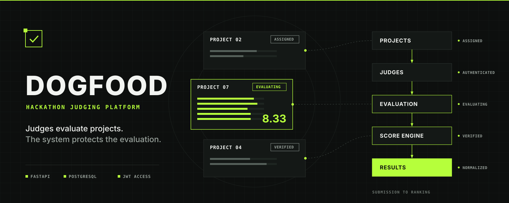
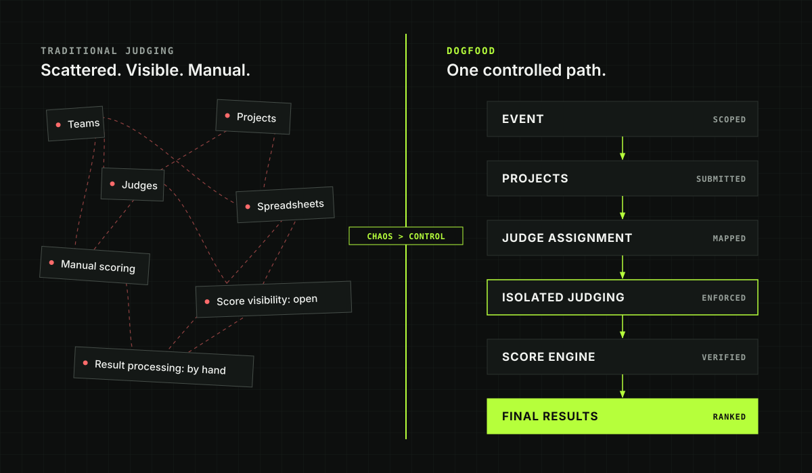
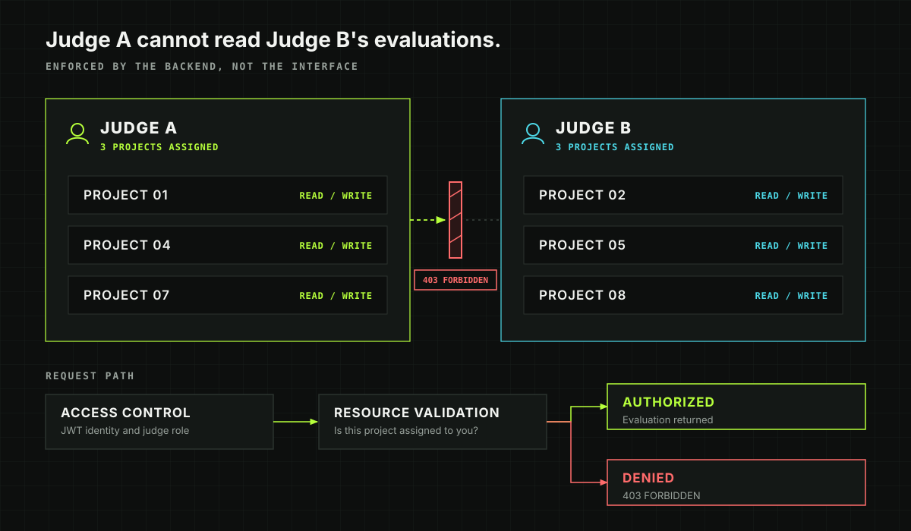
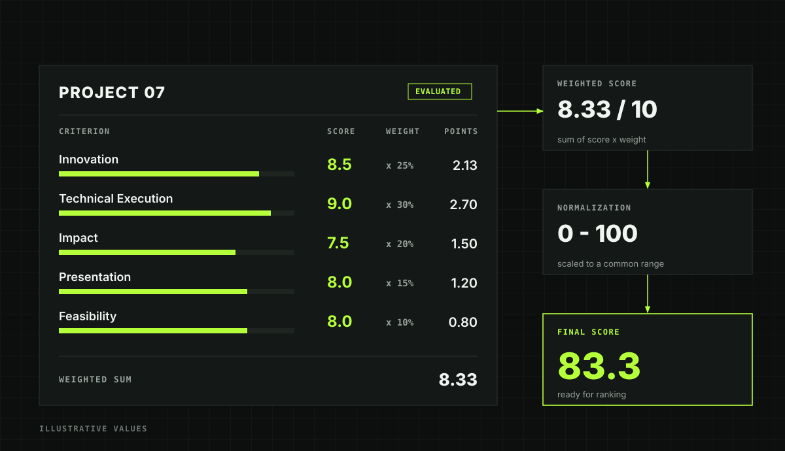
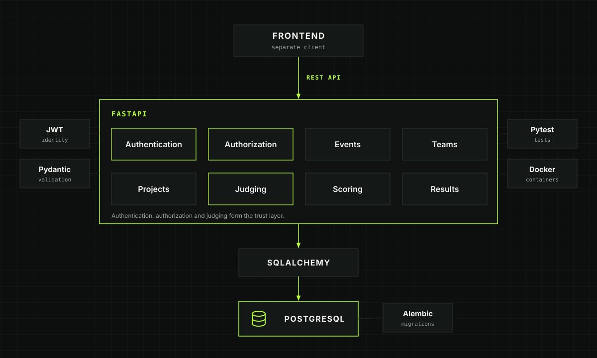
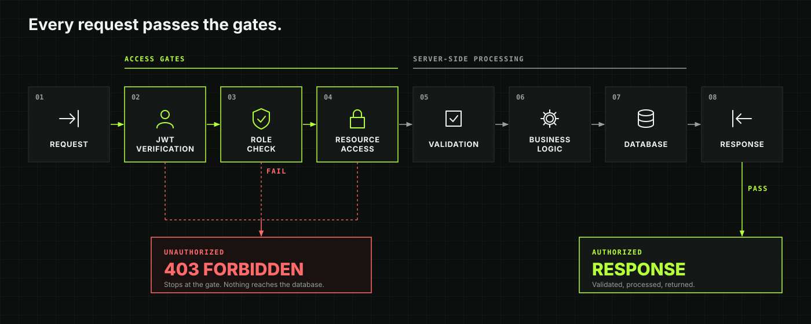
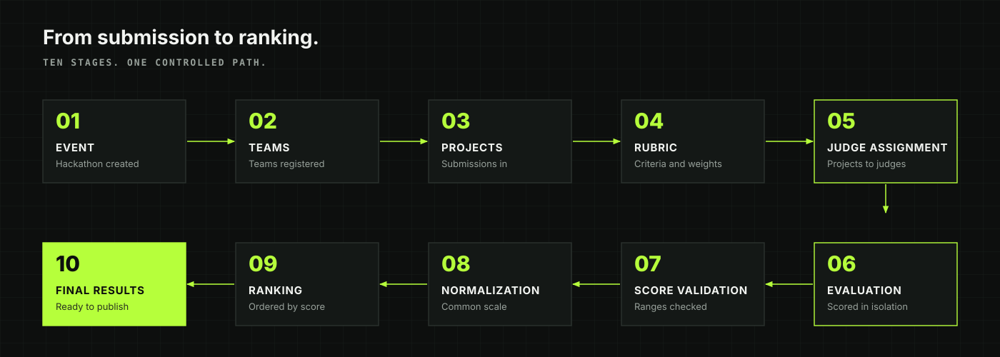
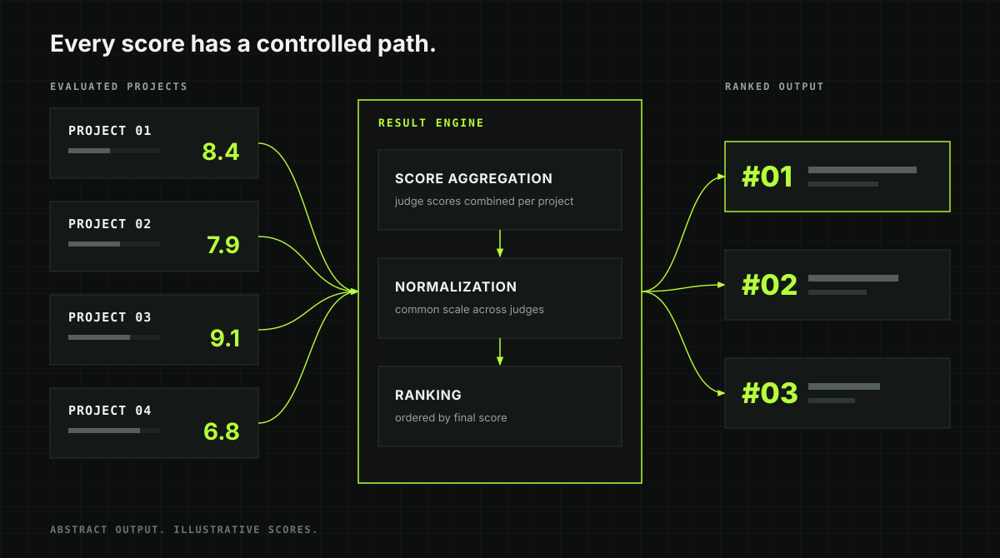
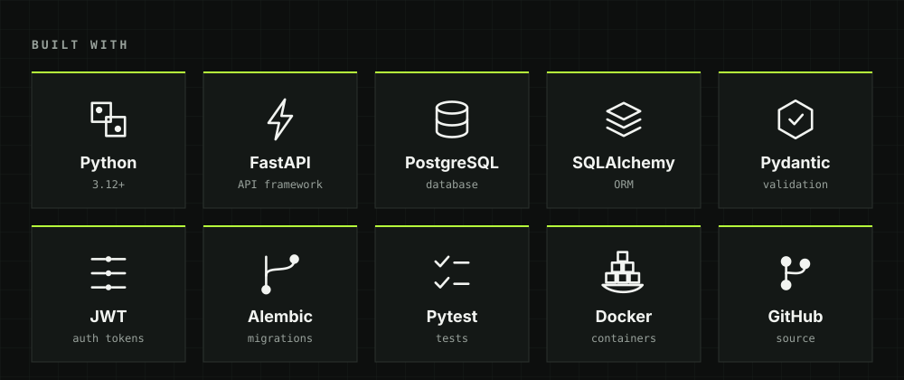
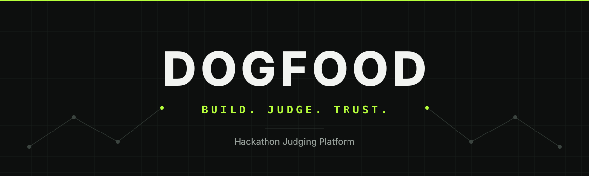

<div align="center">



<br/>

# DOGFOOD

### THE CONTROL LAYER FOR HACKATHON JUDGING

**Projects compete. Judges evaluate. DOGFOOD governs the pipeline.**

<br/>


<br/><br/>

<a href="#01--the-problem">THE PROBLEM</a>
&nbsp; • &nbsp;
<a href="#05--architecture">ARCHITECTURE</a>
&nbsp; • &nbsp;
<a href="#04--evaluation-engine">EVALUATION</a>
&nbsp; • &nbsp;
<a href="#10--api">API</a>
&nbsp; • &nbsp;
<a href="#13--quick-start">QUICK START</a>

</div>

---

<div align="center">

## `01 / THE PROBLEM`

### Hackathon judging shouldn't depend on spreadsheets, manual totals and invisible assumptions.

</div>

<p align="center">

</p>

```text
TRADITIONAL

PROJECTS
   ↓
SPREADSHEETS
   ↓
MANUAL ASSIGNMENTS
   ↓
MANUAL SCORES
   ↓
MANUAL TOTALS
   ↓
RESULT


DOGFOOD

PROJECT
   ↓
ASSIGNMENT
   ↓
AUTHORIZED JUDGE
   ↓
STRUCTURED EVALUATION
   ↓
SCORE PROCESSING
   ↓
RESULT
```

> **The difference is not the interface.**
>
> **The difference is the control layer underneath it.**

---

<div align="center">

## `02 / THE CORE`

### The frontend presents the workflow.
### The backend enforces it.

</div>

```text
                       DOGFOOD
                          │
              ┌───────────┼───────────┐
              │           │           │
              ▼           ▼           ▼
          IDENTITY     ACCESS     EVALUATION
              │           │           │
              └───────────┼───────────┘
                          ▼
                       RESULTS
```

Every protected operation moves through the backend.

```text
REQUEST
   │
   ▼
AUTHENTICATE
   │
   ▼
AUTHORIZE
   │
   ▼
VALIDATE
   │
   ▼
EXECUTE
   │
   ▼
PERSIST
   │
   ▼
RESPOND
```

---

<div align="center">

## `03 / JUDGE ISOLATION`

### ACCESS IS NOT A UI FEATURE.
### IT IS A BACKEND DECISION.

</div>

<p align="center">

</p>

```text
                 ┌──────────────────┐
                 │   JUDGING API    │
                 └────────┬─────────┘
                          │
              ┌───────────┴───────────┐
              │                       │
              ▼                       ▼
          JUDGE A                 JUDGE B
              │                       │
          ┌───┴───┐               ┌───┴───┐
          ▼       ▼               ▼       ▼
        TEAM 01 TEAM 04         TEAM 02 TEAM 05
```

A judge does not receive access because a button is hidden.

The backend checks the request against the judge's identity and assignment.

```text
JUDGE REQUEST
      │
      ▼
IDENTITY
      │
      ▼
ROLE
      │
      ▼
ASSIGNMENT
      │
      ▼
RESOURCE
      │
      ├───────────────┐
      ▼               ▼
   ALLOWED          DENIED
      │               │
      ▼               ▼
   RESPONSE       403 FORBIDDEN
```

---

<div align="center">

## `04 / EVALUATION ENGINE`

### A score is not just a number.
### It is the output of a controlled evaluation.

</div>

<p align="center">

</p>

```text
              CRITERIA
                 │
                 ▼
              WEIGHTS
                 │
                 ▼
             EVALUATION
                 │
                 ▼
               SCORES
                 │
                 ▼
             PROCESSING
                 │
                 ▼
            FINAL RESULT
```

The architecture keeps the evaluation path explicit instead of treating judging as raw form submission.

---

<div align="center">

## `05 / ARCHITECTURE`

### One system.
### Clearly separated responsibilities.

</div>

<p align="center">

</p>

```text
┌────────────────────────────────────────────────────────────┐
│                         CLIENT                             │
└────────────────────────────┬───────────────────────────────┘
                             │
                             │ HTTP / REST
                             ▼
┌────────────────────────────────────────────────────────────┐
│                         FASTAPI                            │
│                                                            │
│  AUTH     EVENTS     TEAMS     PROJECTS     JUDGING       │
│                                                            │
│                    SCORING / RESULTS                       │
└────────────────────────────┬───────────────────────────────┘
                             │
                             ▼
┌────────────────────────────────────────────────────────────┐
│                         DATABASE                           │
└────────────────────────────────────────────────────────────┘
```

### Request pipeline

```text
REQUEST
   ↓
AUTHENTICATE
   ↓
AUTHORIZE
   ↓
VALIDATE
   ↓
EXECUTE
   ↓
PERSIST
   ↓
RESPOND
```

---

<div align="center">

## `06 / SECURITY FLOW`

### Every protected operation passes through the same boundary.

</div>

<p align="center">

</p>

```text
┌──────────────┐
│   REQUEST    │
└──────┬───────┘
       ▼
┌──────────────┐
│ AUTHENTICATE │
└──────┬───────┘
       ▼
┌──────────────┐
│  AUTHORIZE   │
└──────┬───────┘
       ▼
┌──────────────┐
│   VALIDATE   │
└──────┬───────┘
       ▼
┌──────────────┐
│ BUSINESS     │
│    LOGIC     │
└──────┬───────┘
       ▼
┌──────────────┐
│   DATABASE   │
└──────────────┘
```

---

<div align="center">

## `07 / THE JUDGING PIPELINE`

### From an event to a structured verdict.

</div>

<p align="center">

</p>

```text
EVENT
  │
  ▼
TEAM
  │
  ▼
PROJECT
  │
  ▼
JUDGE
  │
  ▼
ASSIGNMENT
  │
  ▼
CRITERIA
  │
  ▼
EVALUATION
  │
  ▼
SCORE
  │
  ▼
PROCESSING
  │
  ▼
RESULT
```

---

<div align="center">

## `08 / RESULT PIPELINE`

### Scores in.
### Structured results out.

</div>

<p align="center">

</p>

```text
PROJECT EVALUATIONS
        │
        ▼
      SCORES
        │
        ▼
    AGGREGATION
        │
        ▼
    PROCESSING
        │
        ▼
      RESULTS
```

**Less manual coordination. More controlled evaluation.**

---

<div align="center">

## `09 / PLATFORM`

</div>

| SYSTEM | PURPOSE |
|:---|:---|
| `AUTH` | Identity & JWT authentication |
| `ACCESS` | Role and resource authorization |
| `EVENTS` | Hackathon event management |
| `TEAMS` | Team management |
| `PROJECTS` | Project management |
| `JUDGING` | Judge assignment & evaluation |
| `SCORING` | Structured score processing |
| `API` | REST + OpenAPI documentation |

---

<div align="center">

## `10 / API`

### Explore the system through interactive OpenAPI documentation.

<br/>

`http://localhost:8000/docs`

</div>

```text
                         API
                          │
        ┌─────────────────┼─────────────────┐
        │                 │                 │
        ▼                 ▼                 ▼
      AUTH              EVENTS            JUDGING
        │                 │                 │
        ▼                 ▼                 ▼
      TEAMS            PROJECTS           SCORES
                          │
                          ▼
                       RESULTS
```

### Run locally

```bash
uvicorn app.main:app --reload
```

Then open:

```text
http://localhost:8000/docs
```

---

<div align="center">

## `11 / TECH STACK`

<p align="center">

</p>

</div>

| LAYER | TECHNOLOGY |
|:---|:---|
| Language | Python 3.12+ |
| Backend | FastAPI |
| Validation | Pydantic |
| Authentication | JWT |
| ORM | SQLAlchemy |
| Database | PostgreSQL |
| API Docs | OpenAPI / Swagger |
| Testing | Pytest |
| Containerization | Docker |
| Collaboration | Git / GitHub |

---

<div align="center">

## `12 / PROJECT STRUCTURE`

</div>

```text
Hackathon-Judging-Platform/
│
├── README.md
│
├── assets/
│   ├── hero.svg
│   ├── problem-solution.svg
│   ├── judging-isolation.svg
│   ├── scoring-engine.svg
│   ├── architecture.svg
│   ├── security-flow.svg
│   ├── evaluation-flow.svg
│   ├── results-engine.svg
│   ├── tech-stack.svg
│   └── footer.svg
│
├── backend/
│   ├── app/
│   ├── tests/
│   ├── requirements.txt
│   └── ...
│
└── frontend/
    └── ...
```

---

<div align="center">

## `13 / QUICK START`

</div>

### Clone

```bash
git clone https://github.com/Nethralfh/Hackathon-Judging-Platform.git
cd Hackathon-Judging-Platform
```

### Backend

```bash
cd backend
```

### Windows

```bash
python -m venv .venv
.venv\Scripts\activate
```

### macOS / Linux

```bash
python3 -m venv .venv
source .venv/bin/activate
```

### Install

```bash
pip install -r requirements.txt
```

### Run

```bash
uvicorn app.main:app --reload
```

### Open

```text
http://localhost:8000/docs
```

---

<div align="center">

## `14 / DOCKER`

</div>

```bash
docker compose up --build
```

---

<div align="center">

## `15 / ROADMAP`

</div>

```text
AUTHENTICATION       ████████████████████  ✓
EVENT MANAGEMENT     ████████████████████  ✓
TEAM MANAGEMENT      ████████████████████  ✓
PROJECT MANAGEMENT   ████████████████████  ✓
JUDGE ASSIGNMENT     ████████████████████  ✓
JUDGING WORKFLOW     ████████████████████  ✓
API DOCUMENTATION    ████████████████████  ✓

RESULT ENGINE        ░░░░░░░░░░░░░░░░░░░░  →
RANKING              ░░░░░░░░░░░░░░░░░░░░  →
ANALYTICS            ░░░░░░░░░░░░░░░░░░░░  →
EXPORTS              ░░░░░░░░░░░░░░░░░░░░  →
AUDIT TRAIL          ░░░░░░░░░░░░░░░░░░░░  →
```

---

<div align="center">

## `16 / THE PRINCIPLE`

# A VERDICT SHOULD HAVE A PATH.

```text
WHO
 ↓
WHAT
 ↓
ASSIGNMENT
 ↓
CRITERIA
 ↓
EVALUATION
 ↓
SCORE
 ↓
PROCESSING
 ↓
RESULT
```

### That path belongs inside the system.

</div>

---

<div align="center">

## `17 / WHY DOGFOOD?`

DOGFOOD is built around a simple engineering philosophy:

```text
BUILD
  ↓
USE
  ↓
TEST
  ↓
MEASURE
  ↓
TRUST
```

**Build the system.  
Use the system.  
Prove the system.**

</div>

---

<div align="center">

## `18 / VISION`

### SIMPLE FOR THE JUDGE.
### RIGOROUS UNDER THE HOOD.

<br/>

```text
                    JUDGE
                      │
                      ▼
                SIMPLE INTERFACE
                      │
                      ▼
                 DOGFOOD API
                      │
        ┌─────────────┼─────────────┐
        ▼             ▼             ▼
     IDENTITY      ACCESS        SCORING
        │             │             │
        └─────────────┼─────────────┘
                      ▼
               STRUCTURED RESULT
```

<br/>



<br/><br/>

# DOGFOOD

### BUILD. JUDGE. TRUST.

<br/>

`SECURE` &nbsp;·&nbsp; `ISOLATED` &nbsp;·&nbsp; `STRUCTURED` &nbsp;·&nbsp; `TRACEABLE`

<br/><br/>

**Projects compete.**

**Judges evaluate.**

**DOGFOOD controls the pipeline.**

<br/><br/>

<a href="https://github.com/Nethralfh/Hackathon-Judging-Platform">
<strong>VIEW THE PROJECT →</strong>
</a>

<br/><br/>

<sub>Hackathon Judging Platform · FastAPI · Python · PostgreSQL</sub>

</div>


<br/>

<div align="center">

# DOGFOOD

### BUILD. JUDGE. TRUST.

`SECURE` &nbsp;·&nbsp; `ISOLATED` &nbsp;·&nbsp; `STRUCTURED` &nbsp;·&nbsp; `TRACEABLE`

<br/>

**Projects compete.**  
**Judges evaluate.**  
**DOGFOOD controls the pipeline.**

<br/><br/>

<a href="https://github.com/Nethralfh/Hackathon-Judging-Platform">

</a>

<br/><br/>

### Like what we're building?

⭐ **Star the repository** if you find DOGFOOD interesting.

🍴 **Fork the project** and experiment with it.

💡 **Open an issue** if you have an idea, improvement, or bug to report.

🤝 **Contributions and collaborations are welcome.**

<br/>

<a href="https://github.com/Nethralfh/Hackathon-Judging-Platform/stargazers">

</a>

<a href="https://github.com/Nethralfh/Hackathon-Judging-Platform/fork">

</a>

<br/><br/>

---

### DEVELOPED WITH PRECISION FOR HACKATHON JUDGING

**DOGFOOD · Hackathon Judging Platform**

<br/>

<sub>
Built to make judging structured, controlled, and transparent.
</sub>

<br/><br/>


<br/><br/>

<sub>
© 2026 DOGFOOD · All Rights Reserved
</sub>

</div>
